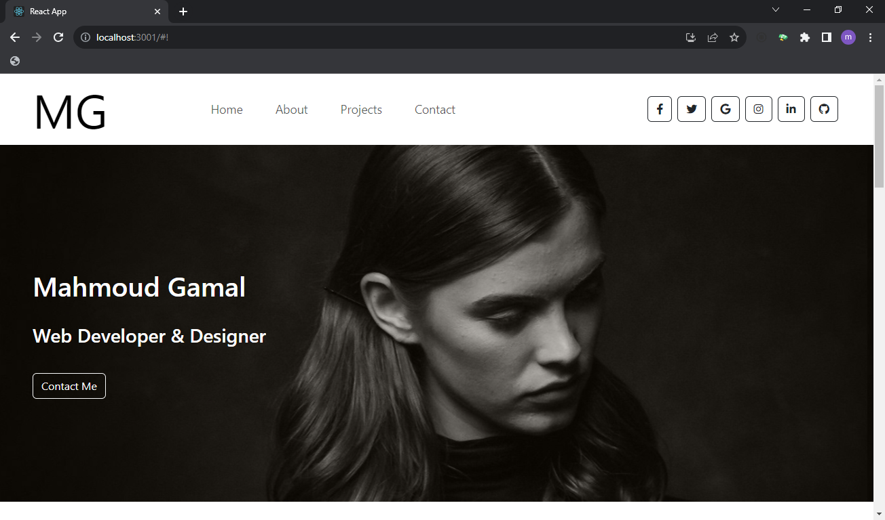

# Portfolio Website Design with React and Bootstrap

The design is taken from [Behance](https://www.behance.net/gallery/93356117Web-Developer-Designer-Portfolio-Website-Design?tracking_source=search_projects|web+developer)

This project is a portfolio website built using React and Bootstrap. It allows you to showcase your work, skills, and personal information in a visually appealing way.

## Table of Contents

- [Portfolio Website Design with React and Bootstrap](#portfolio-website-design-with-react-and-bootstrap)
  - [Table of Contents](#table-of-contents)
  - [Features](#features)
  - [Getting Started](#getting-started)
    - [Prerequisites](#prerequisites)
    - [Installation](#installation)
  - [Usage](#usage)
  - [Customization](#customization)
  - [Built With](#built-with)


## Features

- Responsive design for various screen sizes.
- Sections for your projects, skills, about you, and contact information.
- Easy-to-update content through React components.
- Smooth navigation with a top navigation bar.
- Contact form for potential clients or collaborators.

## Getting Started

Follow these instructions to get a copy of the project up and running on your local machine.

### Prerequisites

Before you begin, ensure you have the following installed on your system:

- Node.js: [Download and Install Node.js](https://nodejs.org/)

### Installation

1. Clone the repository to your local machine:

```bash
git clone https://github.com/your-username/your-portfolio.git
```

2. Change into the project's directory:

```bash
cd your-portfolio
```

3. Install the project dependencies:

```bash
npm install
```

## Usage

To start the development server and view the website on your local machine, run:

```bash
npm start
```

This will launch the website in your default web browser at `http://localhost:3000/`.

You can now customize the content and styling to make it your own portfolio website.

## Customization

To customize the website with your own content, follow these steps:

1. Update the content in the `src/` directory. You'll find files for your projects, skills, and personal information.
2. Modify the components in the `src/components` directory to reflect your design preferences.
3. Customize the styling by editing the Bootstrap classes and adding your own CSS in the `src/styles` directory.
4. Replace the images in the `src/assets` directory with your own project screenshots and profile pictures.

Feel free to explore the project structure and make changes as needed.


## Built With

- [React](https://reactjs.org/) - JavaScript library for building user interfaces.
- [Bootstrap](https://getbootstrap.com/) - CSS framework for responsive web design.

